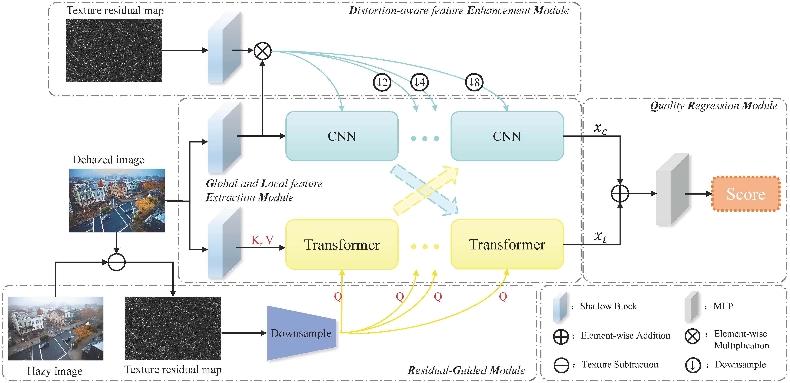
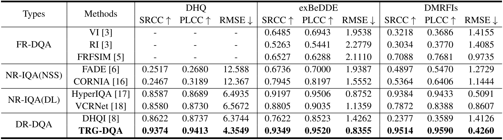
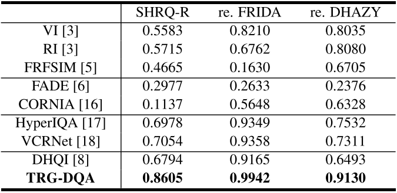

# TRG-DQA: Texture Residual-Guided Dehazed Image Quality Assessment

**by [Tiantian Zeng](https://scholar.google.com.hk/citations?user=gemAtrkAAAAJ&hl=zh-CN), [Lu Zhang](https://scholar.google.com.hk/citations?hl=zh-CN&user=BCzhwesAAAAJ&view_op=list_works&sortby=pubdate), [Wenbin Zou](https://scholar.google.com.hk/citations?user=J8-OQCIAAAAJ&hl=zh-CN), Xia Li, and [Shishun Tian](https://scholar.google.com.hk/citations?user=gk8puWMAAAAJ&hl=zh-CN)**

**[[ICIP2023 Paper]](https://ieeexplore.ieee.org/abstract/document/10222233)**

## Abstract

>_Image dehazing algorithms have emerged to solve the visual impairment caused by haze. It is important to establish dehazed image quality assessment (DQA) methods that can accurately evaluate the dehazed image quality and the performance of dehazing algorithms. However, classical image quality assessment (IQA) and most hand-crafted feature based DQA methods may not be able to adequately measure complex distortions of dehazed images. To address this issue, this paper proposes a Texture Residual-Guided Dehazed image Quality Assessment (TRG-DQA) method. Specifically, we first introduce a global and local feature extraction module employing a combination of the Transformer and convolutional neural networks (CNN) for extracting the comprehensive features. Considering that texture residual maps represent haze density and artifact distortion information, we propose a residual-guided module to guide the model for efficient learning. Additionally, to mitigate the information loss issue that occurs in deeper networks, a distortion-aware feature enhancement module is proposed. Extensive experiments on six DQA databases demonstrate the proposed TRG-DQA achieves superior performance among all the state-of-the-art methods._

## Network architecture


## Comparison with SOTA metrics

Performance comparison on real DQA databases:


Performance comparison on synthetic DQA databases:


## Setup Environment

For this project, we used python 3.8. We recommend setting up a new virtual environment:

```shell
python -m venv ~/venv/trg
source ~/venv/trg/bin/activate
```

In that environment, the requirements can be installed with:

```shell
pip install -r requirements.txt
```

All experiments were executed on an RTX 2080Ti GPU.

## Training
```shell
python train-test-TRG.py
```

## Citation

If you find TRG-DQA useful in your research, please consider citing:

```
@InProceedings{10222233,
  author={Zeng, Tiantian and Zhang, Lu and Zou, Wenbin and Li, Xia and Tian, Shishun},
  booktitle={2023 IEEE International Conference on Image Processing (ICIP)}, 
  title={TRG-DQA: Texture Residual-Guided Dehazed Image Quality Assessment}, 
  year={2023},
  volume={},
  number={},
  pages={3075-3079},
  keywords={Image quality;Databases;Visual impairment;Semantics;Feature extraction;Distortion;Transformers;Dehazed image quality assessment;Texture residual;Distortion-aware feature;CNN;Transformer},
  doi={10.1109/ICIP49359.2023.10222233}}
```

## Acknowledgements

TRG-DQA is based on the following open-source projects. We thank the authors for making the source code publicly available.

* [Conformer](github.com/pengzhiliang/Conformer)
* [VCRNet](https://github.com/NUIST-Videocoding/VCRNet)

